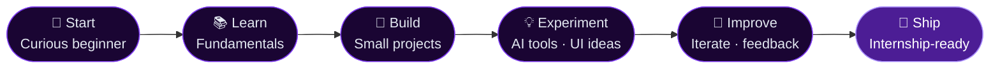

<div align="center">

<a href="https://git.io/typing-svg">
  
</a>

<br/>


&nbsp;


</div>

---

## ◈ Who is vibeRat?

```ts
const rohit = {
  name        : "Rohit Kumawat",
  alias       : "vibeRat",
  role        : "Aspiring Full-Stack Developer · AI Tech Learner",
  status      : "Beginner-to-intermediate — learning in public 📡",
  currentFocus: "Full-stack fundamentals + DSA + real projects",
  exploring   : ["AI workflows", "better UI/UX", "system design basics"],
  philosophy  : "Not trying to know everything. Improving 1% every day.",
  openTo      : "Internships · Collaborations · Feedback",
};
```

I'm a curious builder who learns by doing. I don't have everything figured out — but I show up, ship things, and keep iterating. Currently leveling up my full-stack skills, grinding DSA problems, and experimenting with AI tools to build smarter and faster.

If you're looking for someone obsessed with growth, with strong creative energy and a genuine love for building things — hey, that's me. 👋

---

## ◈ Tech Stack

> Things I actively use and am still mastering.

<div align="center">

**`Languages`**

<table>
  <tr>
    <td align="center" width="96">
      <br/>
      <sub><b>Java</b></sub>
    </td>
    <td align="center" width="96">
      <br/>
      <sub><b>JavaScript</b></sub>
    </td>
    <td align="center" width="96">
      <br/>
      <sub><b>HTML5</b></sub>
    </td>
    <td align="center" width="96">
      <br/>
      <sub><b>CSS3</b></sub>
    </td>
  </tr>
</table>

**`Frontend & Backend`**

<table>
  <tr>
    <td align="center" width="96">
      <br/>
      <sub><b>React ⚡</b></sub>
    </td>
    <td align="center" width="96">
      <br/>
      <sub><b>Node.js ⚡</b></sub>
    </td>
    <td align="center" width="96">
      <br/>
      <sub><b>MySQL</b></sub>
    </td>
    <td align="center" width="96">
      <br/>
      <sub><b>Bootstrap</b></sub>
    </td>
  </tr>
</table>

**`Tools`**

<table>
  <tr>
    <td align="center" width="96">
      <br/>
      <sub><b>Git</b></sub>
    </td>
    <td align="center" width="96">
      <br/>
      <sub><b>GitHub</b></sub>
    </td>
    <td align="center" width="96">
      <br/>
      <sub><b>VS Code</b></sub>
    </td>
    <td align="center" width="96">
      <br/>
      <sub><b>Figma</b></sub>
    </td>
  </tr>
</table>

<sub>⚡ = currently learning / getting comfortable with</sub>

</div>

---

## ◈ Currently Exploring

```
📌  Full Stack Development      — HTML · CSS · JS · React · Node.js · MySQL
📌  DSA & Problem Solving       — Recursion · Graphs · Dynamic Programming
📌  AI Workflows & Tools        — Prompting · AI-assisted dev · automation basics
📌  Better UI/UX                — Design systems · clean layouts · micro-interactions
📌  Real-world Projects         — Building things that actually work
📌  Communication Skills        — Writing · documenting · team-friendly code
```

---

## ◈ My Journey So Far



---

## ◈ Projects

> Small but real. Built to learn, not to impress.

| Project | What It Is | Stack | Status |
|---|---|---|---|
| 🎓 **Campus Event Management** | Web app to manage college events — CRUD, DB, UI | HTML · CSS · JS · MySQL | ✅ Done |
| 🧠 **DSA Practice Repo** | My personal DSA grind journal — solutions + notes | Java | 🔄 Ongoing |
| 🎨 **UI Experiments** | Creative frontend experiments, layouts, animations | HTML · CSS · JS | 🔄 Ongoing |
| ☕ **Java Mini Projects** | Console-based Java programs — OOP, logic building | Java | ✅ Done |

> More coming soon. I build things while I learn, so repos grow over time.

---

## ◈ GitHub Stats

<div align="center">


</div>

---

## ◈ Contribution Activity

<div align="center">


</div>

---

## ◈ Dev Philosophy

```
  Not trying to know everything.
  Not pretending to be a senior.
  Just building, breaking, and figuring it out — one commit at a time.

  "Consistency > perfection. Ship it, then fix it."
```

---

## ◈ Let's Connect

<div align="center">

<a href="https://linkedin.com/in/rohit00">
  
</a>
&nbsp;&nbsp;
<a href="mailto:rohitkumawat123000@gmail.com">
  
</a>
&nbsp;&nbsp;
<a href="https://github.com/RohitKumawat">
  
</a>

<br/><br/>
<sub>Open to internships · collaborations · and building cool things together</sub>

</div>

---


